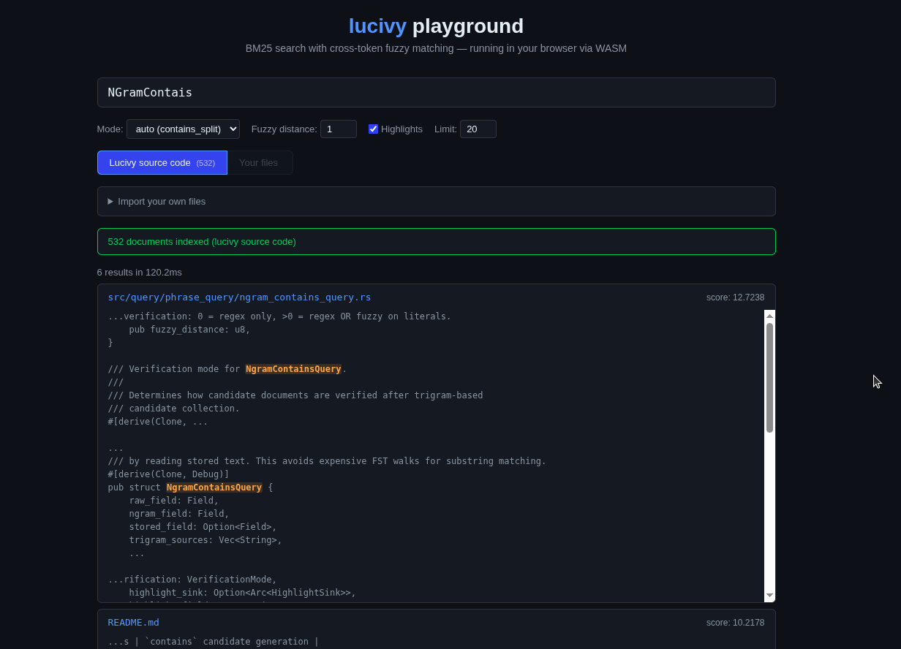

# lucivy

BM25 search engine with cross-token fuzzy matching — it finds substrings, handles typos, and matches across word boundaries. Built for code search, technical docs, and as a BM25 complement to vector databases.

[**Try the live playground**](https://l-defraiteur.github.io/lucivy/) — runs entirely in your browser via WASM.



## Install

Everything is **MIT-licensed**.

| Language | Install |
|----------|---------|
| Python | `pip install lucivy` |
| Node.js | `npm install lucivy` |
| WASM (browser) | `npm install lucivy-wasm` |
| Rust | `cargo add ld-lucivy` |
| C++ | Static library via CXX bridge (build from source) |

## Quick start

```python
import lucivy

index = lucivy.Index.create("./my_index", fields=[
    {"name": "title", "type": "text"},
    {"name": "body", "type": "text"},
])

index.add(1, title="Rust Programming", body="Systems programming with memory safety")
index.add(2, title="Python Guide", body="Data science and web development")
index.commit()

results = index.search("programming", highlights=True)
for r in results:
    print(r.doc_id, r.score, r.highlights)
```

See the language-specific READMEs for full API docs:
- [Python](bindings/python/README.md)
- [Node.js](bindings/nodejs/README.md)
- [WASM / browser](bindings/emscripten/README.md)

## Query types

lucivy queries operate on **stored text** (cross-token). They handle multi-word phrases, substrings, separators, and special characters naturally.

### `contains` — the workhorse query

Fuzzy substring match with separator awareness.

```python
# Exact substring
index.search({"type": "contains", "field": "body", "value": "programming language"})

# Substring within a token: "program" matches "programming"
index.search({"type": "contains", "field": "body", "value": "program"})

# Fuzzy tolerance (default distance=1, catches typos)
index.search({"type": "contains", "field": "body", "value": "programing languag", "distance": 1})

# Strict exact: distance=0 disables fuzzy
index.search({"type": "contains", "field": "body", "value": "programming", "distance": 0})
```

### `contains` + `regex`

Regex on stored text (cross-token).

```python
# Matches "programming language" — the .* spans the space between tokens
index.search({"type": "contains", "field": "body", "value": "program.*language", "regex": True})

# Alternation
index.search({"type": "contains", "field": "body", "value": "python|rust", "regex": True})
```

### `contains_split`

Splits query into words, each word is a `contains`, combined with OR.

```python
# String query (auto contains_split across all text fields)
index.search("rust async programming")

# Explicit dict query on a specific field
index.search({"type": "contains_split", "field": "body", "value": "memory safety"})
```

### `boolean`

Combine sub-queries with must (AND), should (OR), must_not (NOT).

```python
index.search({
    "type": "boolean",
    "must": [
        {"type": "contains", "field": "body", "value": "rust"},
        {"type": "contains", "field": "body", "value": "programming"},
    ],
    "must_not": [{"type": "contains", "field": "body", "value": "javascript"}],
})
```

### Filters on non-text fields

Non-text fields (`i64`, `f64`, `u64`, `keyword`) can be filtered via the `filters` key.

```python
index.search({
    "type": "contains",
    "field": "body",
    "value": "programming",
    "filters": [
        {"field": "year", "op": "gte", "value": 2023},
    ],
})
# Supported ops: eq, ne, lt, lte, gt, gte, in, not_in, between, starts_with, contains
```

### Highlights

All query types support byte-offset highlights. Internal fields (`._raw`, `._ngram`) are automatically filtered out.

```python
results = index.search("rust programming", highlights=True)
for r in results:
    if r.highlights:
        for field, offsets in r.highlights.items():
            print(f"  {field}: {offsets}")  # e.g. "body": [(5, 9), (20, 31)]
```

### Fields (stored values)

Retrieve stored field values alongside search results — useful for displaying file names, titles, or content excerpts.

```python
results = index.search("rust programming", fields=True)
for r in results:
    print(r.doc_id, r.score, r.fields['title'])
```

### Snapshots (export / import)

Export an index to a portable `.luce` binary blob, import it elsewhere.

```python
index.export_snapshot_to("./backup.luce")
restored = lucivy.Index.import_snapshot_from("./backup.luce", dest_path="./restored")
```

## What `contains` matches

**Fuzzy mode** (default):

| Query | Document | Match? | Why |
|-------|----------|--------|-----|
| `programming` | `"Rust programming is fun"` | yes | exact token match |
| `programing` (typo) | `"Rust programming is fun"` | yes | fuzzy distance=1 |
| `program` | `"Rust programming is fun"` | yes | substring of token |
| `programming language` | `"...programming language used..."` | yes | cross-token with separator |
| `c++` | `"c++ and c# are popular"` | yes | separator-aware |
| `std::collections` | `"use std::collections::HashMap"` | yes | multi-token + `::` separator |

**Regex mode** (`regex: true`):

| Pattern | Document | Match? | Why |
|---------|----------|--------|-----|
| `program.*language` | `"...programming language used..."` | yes | cross-token regex on stored text |
| `python\|rust` | `"Python is versatile"` | yes | alternation |
| `v[0-9]+` | `"version v2.0 released"` | yes | full-scan fallback (literal < 3 chars) |

## Internals

### Triple-field layout

Every text field automatically gets 3 sub-fields:

| Sub-field | Tokenizer | Used by |
|-----------|-----------|---------|
| `{name}` | stemmed or lowercase | `phrase`, `parse` queries (recall) |
| `{name}._raw` | lowercase only | `contains` verification (precision) |
| `{name}._ngram` | character trigrams | `contains` candidate generation |

This is transparent to the user — you always reference the base field name.

### NgramContainsQuery — how `contains` works

1. **Candidate collection** — depends on mode:
   - *Fuzzy*: term dictionary lookup on `._raw` (O(1) via FST), falling back to trigram intersection on `._ngram` if the exact term isn't found
   - *Regex*: trigram union on `._ngram` from extracted regex literals
   - *Short literals*: full segment scan when literals < 3 chars
2. **Verification** — read stored text, dispatch to fuzzy or regex verifier
3. **BM25 scoring** — standard `idf * (1 + k1) * tf / (tf + k1 * (1 - b + b * dl / avgdl))`

## Building from source

```bash
# Rust library tests
cargo test --lib

# Python bindings
cd bindings/python
maturin develop --release
pytest tests/ -v

# Node.js bindings
cd bindings/nodejs && npm run build
node test.mjs

# C++ bindings
cargo build -p lucivy-cpp --release
```

## Lineage

Fork of [tantivy](https://github.com/quickwit-oss/tantivy) v0.26.0 (via [izihawa/tantivy](https://github.com/izihawa/tantivy)).

```
quickwit-oss/tantivy v0.22
  -> izihawa/tantivy v0.26.0 (regex phrase queries, FST improvements)
    -> L-Defraiteur/lucivy (NgramContainsQuery, contains_split, fuzzy/regex/hybrid modes, HighlightSink, Python/Node.js/C++/WASM bindings)
```

## License

MIT. See [LICENSE](LICENSE).

Fork of [tantivy](https://github.com/quickwit-oss/tantivy) v0.26.0, also MIT (see [NOTICE](NOTICE)).
