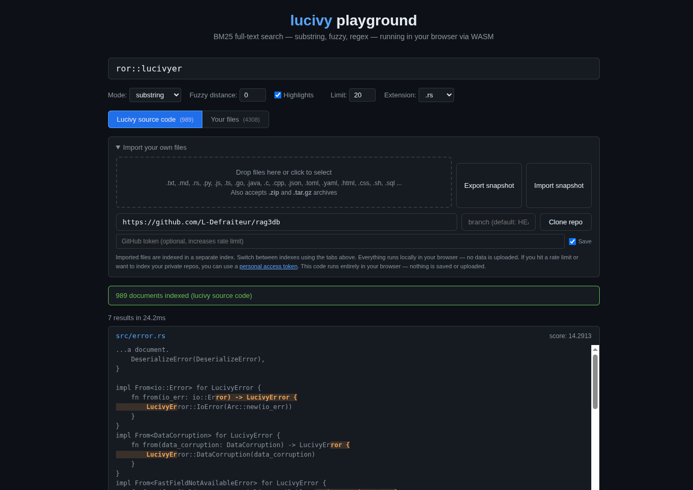

# lucivy

BM25 full-text search engine with substring matching, fuzzy search, and regex — all cross-token aware.

Built for code search, technical documentation, and as a BM25 complement to vector databases.

[**Try the live playground**](https://l-defraiteur.github.io/lucivy/) — runs entirely in your browser via WASM.



## What makes lucivy different

Most search engines match **whole tokens**. Search for "mutex" and you'll find the word "mutex" — but not "getMutexHandle" or "lockmutex", because the tokenizer sees those as single opaque tokens. lucivy matches **substrings inside tokens**: "mutex" finds every occurrence, even buried inside compound words, camelCase identifiers, or concatenated strings.

This works because lucivy builds a **Suffix FST** (.sfx) at indexing time. Every suffix of every token is indexed, partitioned by position (SI=0 = token start, SI>0 = substring). This makes substring search as precise as exact-match search, with BM25 scoring.

### Cross-token matching

Tokenizers split text at word boundaries. "rag3weaver" becomes ["rag3", "weaver"]. Traditional search can't find the original compound — lucivy can. The SFX engine follows **sibling links** across token boundaries to reconstruct matches that span multiple tokens.

### Fuzzy with trigram pigeonhole

Fuzzy search (Levenshtein distance) uses a **trigram pigeonhole** strategy: at distance d, at least one trigram of the query must appear exactly. lucivy finds that trigram via the SFX, then validates the full match. This avoids scanning the entire index — only candidates with at least one exact trigram are evaluated.

### Regex with literal extraction

Regex queries are optimized by extracting **literal parts** from the pattern. "log_[a-z]+_error" has literals "log_" and "_error". lucivy searches for these via SFX first, then validates the full regex only on candidates. No full-index scan.

### BM25 scoring — correct across shards

lucivy uses standard BM25 scoring. In sharded mode, global statistics (document frequency, total docs, total tokens) are aggregated before scoring, so results are **identical** whether you use 1 shard or 4. No approximation.

## Install

Everything is **MIT-licensed**.

| Language | Install |
|----------|---------|
| Python | `pip install lucivy` |
| Node.js | `npm install lucivy` |
| WASM (browser) | `npm install lucivy-wasm` |
| Rust | `cargo add lucivy-core` |
| C++ | Static library via CXX bridge (build from source) |

## Quick start

### Python

```python
import lucivy

# Create an index
index = lucivy.Index.create("/tmp/my_index", fields=[
    {"name": "body", "type": "text", "stored": True}
])

# Add documents
index.add(1, body="The pthread_mutex_lock function acquires a mutex")
index.add(2, body="Use std::lock_guard for RAII mutex management")
index.commit()

# Substring search — finds "mutex" inside "pthread_mutex_lock"
results = index.search({"type": "contains", "field": "body", "value": "mutex"})

# Fuzzy search — finds "mutex" even with a typo ("mutx")
results = index.search({"type": "contains", "field": "body", "value": "mutx", "distance": 1})

# Regex — finds "lock" followed by anything then "mutex"
results = index.search({"type": "contains", "field": "body", "value": "lock.*mutex", "regex": True})

# Prefix / startsWith — finds tokens starting with "pthread"
results = index.search({"type": "contains", "field": "body", "value": "pthread", "anchor_start": True})
```

### Node.js

```javascript
const { Index } = require('lucivy');

const index = Index.create('/tmp/my_index', [
    { name: 'body', type: 'text', stored: true }
]);

index.add(1, { body: 'The pthread_mutex_lock function acquires a mutex' });
index.commit();

const results = index.search({ type: 'contains', field: 'body', value: 'mutex' });
```

### Sharded

```python
# 4 shards — documents are distributed across shards
index = lucivy.Index.create("/tmp/sharded", fields=[
    {"name": "body", "type": "text", "stored": True}
], shards=4)
```

### Distributed search (multi-machine)

```python
import lucivy

query = {"type": "contains", "field": "body", "value": "mutex"}

# 1. Each node exports its local BM25 stats
stats_a = node_a.export_stats(query)  # JSON string
stats_b = node_b.export_stats(query)  # JSON string

# 2. Coordinator merges stats from all nodes
merged = lucivy.merge_stats([stats_a, stats_b])

# 3. Each node searches with global stats (correct IDF)
results_a = node_a.search_with_global_stats(query, merged, limit=10)
results_b = node_b.search_with_global_stats(query, merged, limit=10)

# 4. Coordinator merges top-K results by score
all_results = sorted(results_a + results_b, key=lambda r: r.score, reverse=True)[:10]
```

### Incremental sync

```python
# Client sends its shard versions to the server
client_versions = client_index.shard_versions

# Server: export delta (only segments that changed since client's version)
delta = server_index.export_sharded_delta(client_versions)

# Client: apply delta (writes new segments, removes old, reloads readers)
client_index.apply_sharded_delta(delta)
```

## Features

### Search

- **Substring search** — find text inside tokens, not just whole tokens
- **Fuzzy search** — Levenshtein distance with trigram acceleration
- **Regex** — cross-token regex with literal-part optimization
- **Phrase** — multi-token adjacency with cross-token awareness
- **Prefix / startsWith** — anchor to token start (SI=0)
- **Exact match** — cross-token aware full-token matching
- **Highlights** — byte-offset highlights for all query types
- **Filters** — non-text field filtering (numeric ranges, equality, membership)
- **BM25 scoring** — correct cross-shard statistics
- **More Like This** — find similar documents by reference text

### Indexing

- **Sharded** — configurable routing distributes documents across N shards for parallel search
- **Incremental** — add, delete, update documents with lazy commit
- **Background finalize** — segment finalization runs on a pool thread, not in the indexer
- **Configurable merge policy** — log-based merge with tunable thresholds

### Sync & Distribution

- **LUCE** — full snapshot export/import (all shards in one blob)
- **LUCID** — incremental delta sync for a single shard (only changed segments)
- **LUCIDS** — incremental delta sync across multiple shards
- **Distributed search** — export_stats / merge / search_with_global_stats pipeline

### Platforms

- **Python** (PyO3) — `pip install lucivy` — [README](bindings/python/README.md)
- **Node.js** (NAPI) — `npm install lucivy` — [README](bindings/nodejs/README.md)
- **Browser / WASM** (emscripten) — SharedArrayBuffer + multithreaded — [README](bindings/emscripten/README.md)
- **Rust** — `lucivy-core` on crates.io
- **C++** — cxx bridge

## Query reference

| Parameter | Type | Default | Description |
|-----------|------|---------|-------------|
| `type` | string | required | `"contains"`, `"contains_split"`, `"boolean"`, etc. |
| `field` | string | required | Field to search |
| `value` | string | required | Search text or regex pattern |
| `distance` | int | 0 | Levenshtein distance for fuzzy (0 = exact) |
| `anchor_start` | bool | false | Match must start at token boundary (SI=0) |
| `exact_match` | bool | false | Match must cover entire token(s) |
| `regex` | bool | false | Treat value as regex pattern |
| `filters` | array | none | Non-text field filters (eq, gt, in, between, ...) |

### Query types

| Type | Description |
|------|-------------|
| `contains` | Substring, fuzzy, or regex search (cross-token) |
| `contains_split` | Split on whitespace, each word is a `contains`, combined with OR |
| `boolean` | Combine sub-queries with must / should / must_not |
| `term` | Legacy compat — routes to `contains` + `anchor_start` + `exact_match` |
| `fuzzy` | Legacy compat — routes to `contains` + `distance` |
| `regex` | Legacy compat — routes to `contains` + `regex=true` |
| `phrase` | Legacy compat — routes to `contains` |
| `startsWith` | Legacy compat — routes to `contains` + `anchor_start` |

## Performance

Benchmarked on 90,000 files from the Linux kernel source tree (top-20 results, 3-run average):

| Query | 1 shard | 4 shards |
|-------|---------|----------|
| `contains 'mutex_lock'` | 261ms | 137ms |
| `contains 'function'` | 127ms | 131ms |
| `contains_split 'struct device'` | 338ms | 347ms |
| `contains 'sched'` | 119ms | 128ms |
| `startsWith 'sched'` | 185ms | 178ms |
| `fuzzy 'schdule' (d=1)` | 559ms | 318ms |
| `regex 'mutex.*lock'` | - | 373ms |
| `regex 'kmalloc.*sizeof'` | - | 442ms |
| `contains 'drivers'` (path field) | 7ms | 7ms |

Indexation: 90K docs in **50s** (1 shard) / **100s** (4 shards round-robin).

> These are **substring** queries — not simple term dictionary lookups. Every query searches inside tokens, across token boundaries, with BM25 scoring. Direct comparison with traditional full-text engines is not apples-to-apples: they would return 0 results for most of these queries.

## Architecture

```
Document -> Tokenizer -> Postings (inverted index)
                      -> SFX (suffix FST + sfxpost)
                      -> Fast fields
                      -> Doc store (compressed)

Query -> SFX walk (substring/fuzzy/regex)
      -> Posting resolve (doc_ids + positions)
      -> BM25 scoring (with global stats)
      -> Highlights (byte offsets)
```

### SFX file format

Each indexed segment contains:
- `.sfx` — Suffix FST with partitioned SI=0 / SI>0 entries
- `.sfxpost` — Posting lists mapping suffix ordinals to doc_ids
- `.termtexts` — Token text storage for cross-token sibling chain resolution
- `.gapmap` — Gap-encoded byte sequences for separator tracking

### Sharding

Documents are distributed across shards via configurable routing (`balance_weight`):

- **`balance_weight=1.0`** (default) — round-robin-like. Even distribution, fastest indexation.
- **`balance_weight=0.2`** — token-aware. Co-locates documents sharing rare tokens.
- **`balance_weight=0.0`** — pure token-aware. Maximum co-location.

## Building from source

```bash
# Rust library tests
cargo test --lib

# Python bindings
cd bindings/python && maturin develop --release

# Node.js bindings
cargo build -p lucivy-napi --release
cp target/release/liblucivy_napi.so bindings/nodejs/lucivy.node

# C++ bindings
cargo build -p lucivy-cpp --release

# WASM (emscripten)
bash bindings/emscripten/build.sh
```

## License

MIT. See [LICENSE](LICENSE).
