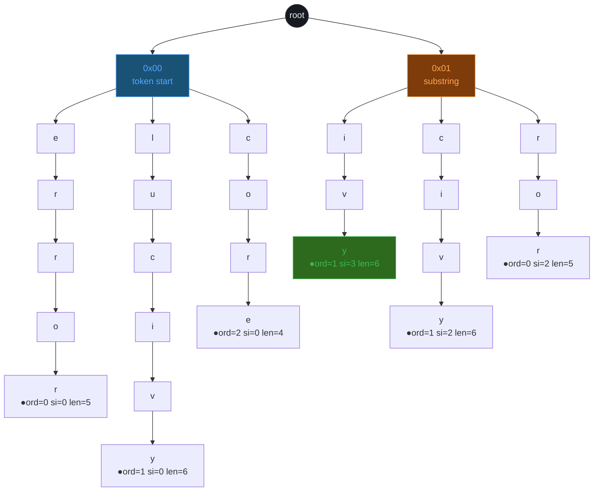
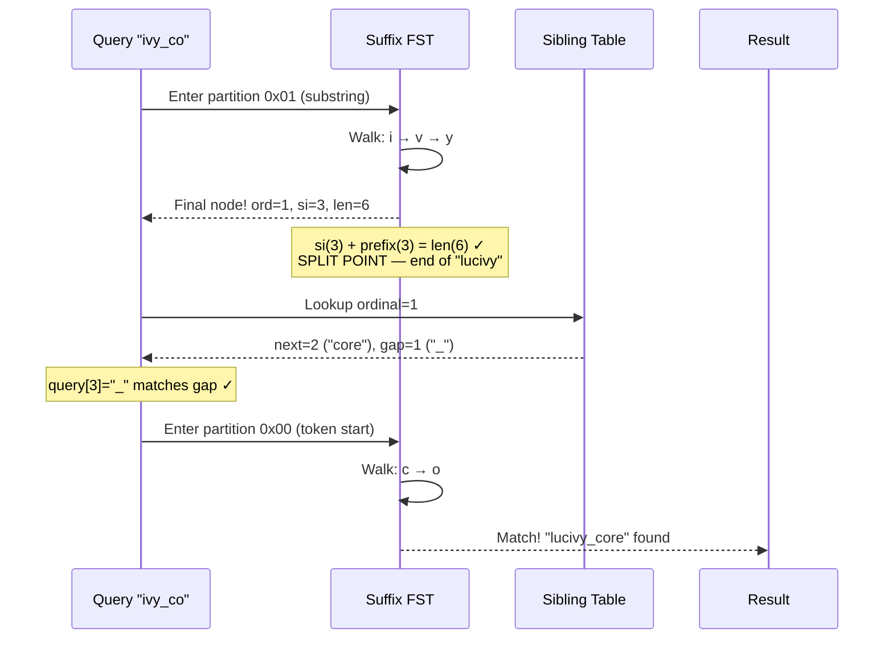

# SFX FST — Diagramme et prompt image

## Le mécanisme en détail

### Etape 1 : Indexation — decomposition en suffixes

Le token `"lucivy"` (6 bytes) est decomposé en TOUS ses suffixes :

```
SI=0  →  lucivy    (debut du token, partition 0x00)
SI=1  →  ucivy     (partition 0x01)
SI=2  →  civy      (partition 0x01)
SI=3  →  ivy       (partition 0x01)
SI=4  →  vy        (partition 0x01)
SI=5  →  y         (partition 0x01)
```

Chaque suffix est inseré dans le FST (un trie trié) avec comme valeur :
- `raw_ordinal` = l'identifiant du token parent
- `si` = l'offset du suffix dans le token
- `token_len` = la longueur totale du token

### Etape 2 : Le FST partitionné

Le FST a deux branches racines :

```
racine
├── 0x00 (SI=0 — débuts de tokens)
│   ├── c─o─r─e          → ordinal=2, si=0, token_len=4  ("core")
│   ├── e─r─r─o─r        → ordinal=0, si=0, token_len=5  ("error")
│   └── l─u─c─i─v─y      → ordinal=1, si=0, token_len=6  ("lucivy")
│
└── 0x01 (SI>0 — substrings)
    ├── c─i─v─y           → ordinal=1, si=2, token_len=6  (suffix de "lucivy")
    ├── i─v─y             → ordinal=1, si=3, token_len=6  (suffix de "lucivy")
    ├── o─r─e             → ordinal=2, si=1, token_len=4  (suffix de "core")
    ├── r─e               → ordinal=2, si=2, token_len=4  (suffix de "core")
    ├── r─o─r             → ordinal=0, si=2, token_len=5  (suffix de "error")
    ├── r─r─o─r           → ordinal=0, si=1, token_len=5  (suffix de "error")
    ├── u─c─i─v─y         → ordinal=1, si=1, token_len=6  (suffix de "lucivy")
    ├── v─y               → ordinal=1, si=4, token_len=6  (suffix de "lucivy")
    └── y                 → ordinal=1, si=5, token_len=6  (suffix de "lucivy")
```

### Etape 3 : Sibling table (liens cross-token)

La sibling table enregistre les tokens adjacents dans le texte original.
Si le texte indexé contient `"lucivy_core"`, le tokenizer produit ["lucivy", "core"]
et la sibling table enregistre :

```
ordinal=1 (lucivy)  →  next_ordinal=2 (core), gap_len=1 ("_")
```

### Etape 4 : Recherche — falling_walk pour "ivy_co"

```
Query: "ivy_co"

1. Entrer dans la partition 0x01 (substring)
2. Marcher byte par byte : i → v → y
3. Au byte 3 ("ivy"), le FST atteint un noeud final
   → ordinal=1, si=3, token_len=6
   → Vérifier : si(3) + prefix_len(3) == token_len(6) ✓
   → C'est un SPLIT POINT — "ivy" couvre la fin du token "lucivy"

4. A ce split point, consulter la sibling table :
   ordinal=1 → next_ordinal=2, gap_len=1

5. Vérifier que le query byte au split point correspond au gap :
   query[3] = "_" et gap_len=1 → OK, c'est le separateur

6. Continuer le walk sur le token suivant (ordinal=2, "core") :
   Entrer dans la partition 0x00 (SI=0, debut de token)
   Marcher : c → o
   → Match partiel trouvé !

Résultat : "ivy_co" matche "lucivy_core" cross-token.
```

## Mermaid — FST partitionné



## Mermaid — Falling walk pour "ivy_co"



## Prompt image ultra-detaillé

### Prompt principal (à donner à Gemini)

```
Create a technical illustration explaining how a Suffix FST search engine works,
using the specific example of searching for "ivy_co" which matches "lucivy_core"
across token boundaries.

The illustration should show these elements on a dark navy (#0d1117) background:

LEFT SIDE — "Suffix Decomposition":
Show the word "lucivy" vertically decomposed into all its suffixes, each on its
own line with a SI (suffix index) label:
  SI=0: "lucivy"  (highlighted in cyan #58a6ff — this is the token start)
  SI=1: "ucivy"   (in warm orange #ffa657)
  SI=2: "civy"    (in orange)
  SI=3: "ivy"     (in BRIGHT GREEN #3fb950 — this is the one that will match)
  SI=4: "vy"      (in orange, dimmer)
  SI=5: "y"       (in orange, dimmer)

CENTER — "The Suffix FST" (the main visual):
A trie/tree structure. The root splits into two branches:
- Left branch labeled "0x00 — token start" in cyan. Under it, three paths:
  "error", "lucivy", "core" — each ending at a terminal node (filled circle).
- Right branch labeled "0x01 — substring" in orange. Under it, paths for
  suffixes: "ivy", "civy", "ror", "ore", etc. — each ending at a terminal
  node that shows (ordinal, si, token_len).

The path i→v→y under the orange branch should GLOW BRIGHT GREEN to show
the active search walk. Its terminal node should be highlighted with the
annotation: "ord=1, si=3, len=6 → SPLIT POINT".

BETWEEN CENTER AND RIGHT — "Sibling Link":
A bright glowing arc (like an electric bridge) connects the "lucivy" terminal
node to the "core" terminal node, labeled "sibling link, gap=1 (_)".
This is the cross-token bridge.

RIGHT SIDE — "Cross-token match":
Show the search query "ivy_co" as a horizontal sequence of character boxes.
The first 3 characters "i","v","y" have a green underline pointing to the
orange partition. The "_" character has a small bridge icon. The last 2
characters "c","o" have a cyan underline pointing to the cyan partition
(token start of "core").

Below, show the final result: the full text "lucivy_core" with "ivy" highlighted
in green at position SI=3 and "co" highlighted in cyan at position SI=0 of "core",
connected by the "_" separator.

STYLE:
- Dark background (#0d1117), like a code editor
- Monospace font for all text (SF Mono or Fira Code style)
- Cyan (#58a6ff) for SI=0 / token start elements
- Orange (#ffa657) for SI>0 / substring elements
- Bright green (#3fb950) for the active match path
- Thin white lines for tree connections, glowing for active paths
- Terminal nodes as filled circles
- Clean, minimal, no gradients, flat vector style
- 16:9 landscape format
- No title text on the image itself
```

### Prompt alternatif — plus simple, plus impactant

```
A dark background technical illustration showing a search for "ivy" finding
the word "lucivy" through a Suffix FST.

The word "lucivy" is shown large at the top, with each character in its own
rounded cell. Below it, 6 horizontal arrows point down to 6 suffix entries,
stacked vertically:
  "lucivy" (SI=0, cyan glow — full token)
  "ucivy"  (SI=1, dim orange)
  "civy"   (SI=2, dim orange)  
  "ivy"    (SI=3, BRIGHT GREEN GLOW — this is the match)
  "vy"     (SI=4, dim orange)
  "y"      (SI=5, dim orange)

These suffixes feed into a central trie structure (the FST). The trie has
clean branching paths. The path for "ivy" (i→v→y) glows bright green.

At the bottom, the search query "ivy" enters from the left as a bright green
beam, walks the trie path i→v→y, and arrives at the glowing terminal node
labeled "→ lucivy (SI=3)".

A second example on the right shows cross-token: "ivy_core" as query, with
a glowing bridge between "lucivy" and "core" nodes, labeled "sibling link".

Dark code editor background. Monospace font. Cyan for token starts, orange
for substrings, green for matches. Clean flat vector style. 16:9 landscape.
```
