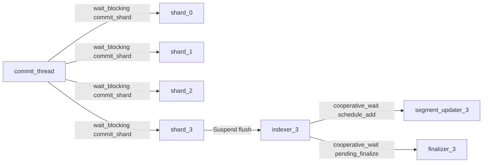
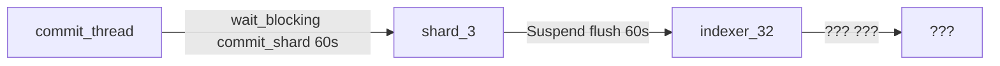
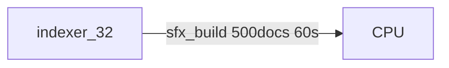
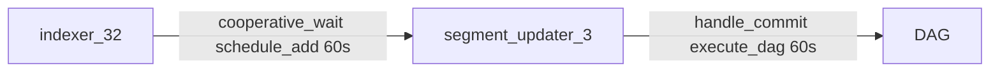

# Plan : Dependency Graph — Traçabilité totale des inter-thread calls

## Le problème

On diagnostique à l'aveugle. On voit "indexer TAKEN 5min" mais pas POURQUOI.
Chaque inter-thread call (send message, wait reply, cooperative wait, Suspend)
est invisible. On ne sait pas :
- Qui attend qui
- Depuis combien de temps
- Quelle chaîne de dépendances forme un cycle

## La vision

**UN SEUL pattern partout** : "j'envoie telle tâche à tel acteur, j'attends
qu'il finisse, et ça s'inscrit dans un graph".

Chaque opération inter-thread s'enregistre dans un graph global.
Un dump mermaid montre les EDGES de dépendance, pas juste les nodes.



Quand ça bloque, un seul dump suffit pour voir toute la chaîne.

## Design : WaitGraph

### Structure

```rust
/// Global wait graph — tracks all inter-thread dependencies.
pub struct WaitGraph {
    edges: Mutex<Vec<WaitEdge>>,
}

pub struct WaitEdge {
    /// Who is waiting
    waiter: WaiterId,
    /// What they're waiting for (actor, task, reply)
    target: WaitTarget,
    /// Label for diagnostics
    label: &'static str,
    /// When the wait started
    since: Instant,
}

pub enum WaiterId {
    Thread(ThreadId, String),     // thread id + name
    Actor(ActorId, &'static str), // actor id + name
}

pub enum WaitTarget {
    Actor(ActorId, &'static str),
    Reply(u64),  // reply id
    Task(u64),   // task id
}
```

### Fichier : `luciole/src/wait_graph.rs`

### Instrumentation

Chaque point d'attente s'enregistre au début et se désenregistre à la fin :

```rust
// scheduler.wait()
pub fn wait<T>(&self, rx: ReplyReceiver<T>, label: &str) -> T {
    let edge_id = WAIT_GRAPH.register(
        WaiterId::current_thread_or_actor(),
        WaitTarget::Reply(rx.id()),
        label,
    );
    let value = /* actual wait */;
    WAIT_GRAPH.unregister(edge_id);
    value
}

// ActorRef::send() with reply
pub fn request<R, F>(&self, make_msg: F, label: &str) -> Result<R, String> {
    let edge_id = WAIT_GRAPH.register(
        WaiterId::current_thread_or_actor(),
        WaitTarget::Actor(self.actor_id(), self.actor_name()),
        label,
    );
    let value = /* send + wait */;
    WAIT_GRAPH.unregister(edge_id);
    value
}

// JoinResume — register N edges
let join = JoinResume::new(N, resume);
for rx in &flush_rxs {
    WAIT_GRAPH.register(
        WaiterId::Actor(shard_id, "shard"),
        WaitTarget::Reply(rx.id()),
        "flush_wait",
    );
    rx.set_resume(join.one_shot());
}
```

### Dump

```rust
impl WaitGraph {
    pub fn dump_mermaid(&self) -> String {
        let edges = self.edges.lock().unwrap();
        let mut out = String::from("graph LR\n");
        for edge in edges.iter() {
            let elapsed = edge.since.elapsed().as_secs();
            out += &format!(
                "    {} -->|{} ({}s)| {}\n",
                edge.waiter.label(), edge.label, elapsed, edge.target.label(),
            );
        }
        out
    }
}
```

### Export C FFI

```rust
#[no_mangle]
pub extern "C" fn lucivy_dump_wait_graph() -> *const c_char {
    return_str(WAIT_GRAPH.dump_mermaid())
}
```

Appelable depuis le main thread même quand le worker est bloqué :
```js
// Via SAB log ring ou via un second worker dédié au diag
```

## Instrumentation à ajouter (par priorité)

### Phase 1 : les waits (blocage visible)

| Lieu | Waiter | Target | Label |
|------|--------|--------|-------|
| `scheduler.wait()` | thread courant | Reply | label param |
| `Pool::scatter` | thread courant | Actor (worker N) | "scatter_{label}" |
| `Pool::drain` | thread courant | Actor (worker N) | "drain_{label}" |
| `ActorRef::request` | thread courant | Actor | label param |
| `wait_cooperative_named` | thread courant | Reply | label param |
| `JoinResume` | Actor (Suspended) | Reply (×N) | "join_{label}" |

### Phase 2 : les handlers (blocage invisible)

| Lieu | Waiter | Target | Label |
|------|--------|--------|-------|
| `finalize_segment` → `schedule_add_segment` | indexer | segment_updater | "add_segment" |
| `finalize_segment` → `segment_writer.finalize` | indexer | (self, CPU) | "sfx_build" |
| `handle_flush` → `wait_pending_finalize` | indexer | finalizer | "pending_finalize" |
| `handle_commit` → `execute_dag` | segment_updater | (DAG) | "commit_dag" |

### Phase 3 : les activités longues

Pour les opérations CPU-bound (pas un wait inter-thread mais une opération
longue), un simple "activity label" sur le ThreadInfo suffit :

```rust
thread_info.set_activity("sfx_build 500 docs");
segment_writer.finalize();
thread_info.clear_activity();
```

## Plan d'implémentation

### Étape 1 : WaitGraph (luciole/src/wait_graph.rs)
- `WaitGraph`, `WaitEdge`, `WaiterId`, `WaitTarget`
- `register()`, `unregister()`, `dump_mermaid()`
- `WAIT_GRAPH` global (lazy static)
- Tests unitaires

### Étape 2 : Instrumenter scheduler.wait()
- Wrap wait_blocking et wait_cooperative avec register/unregister
- Dump automatique dans les warnings (remplace le dump ad-hoc actuel)

### Étape 3 : Instrumenter les points d'attente lucivy
- finalize_segment, handle_flush, handle_commit
- Pool::scatter, Pool::drain
- JoinResume dans ShardActor

### Étape 4 : Export C FFI
- `lucivy_dump_wait_graph()` → mermaid string
- Appelable en eval même pendant un blocage (si le main thread est libre)

### Étape 5 : Diagnostic automatique
- Si un wait dépasse 10s → dump le wait graph dans les logs (eprintln)
- Si un cycle est détecté → log "CYCLE DETECTED" + le cycle

## Bonus : identifier le bug actuel avec le graph

Avec le wait graph, le dump au blocage montrerait :



Le "???" c'est exactement ce qu'on ne voit pas aujourd'hui. Avec
l'instrumentation Phase 2, on verrait :


ou

ou
```mermaid
    indexer_32 -->|cooperative_wait pending_finalize 60s| finalizer_3
    finalizer_3 -->|IDLE q:0| (not dispatched)
```

Chaque cas pointe directement vers le fix nécessaire.

## Ce qui manque au fix actuel (à résoudre avec la visibilité)

1. **L'indexer bloqué** : TAKEN 5min, q:0, aucun log de FlushMsg ni finalize.
   → le wait graph dira exactement sur quoi il attend.

2. **Race OPFS** : le reload de la page charge l'ancien index depuis OPFS,
   créant un premier jeu d'actors. Le clone crée un second jeu. Les deux
   partagent le même scheduler global. Un actor de l'ancien index pourrait
   capturer un thread.
   → le wait graph montrera les actors des DEUX index.

3. **Priorité des merges** : les merges en background capturent des threads.
   → à résoudre après le commit clean, mais le wait graph aidera à calibrer.
