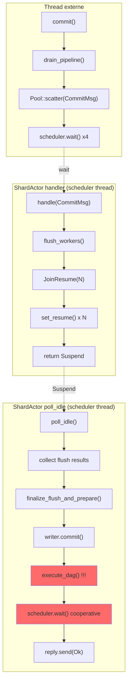
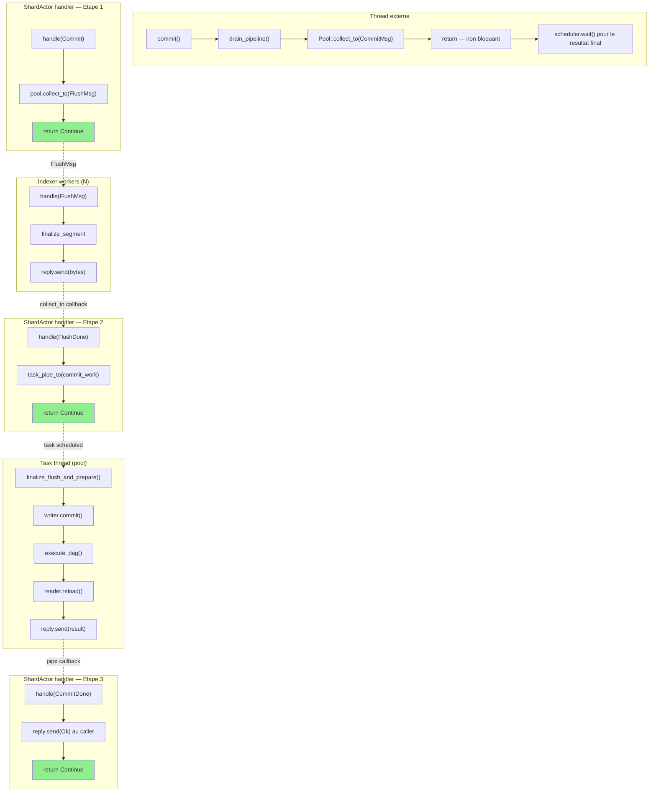
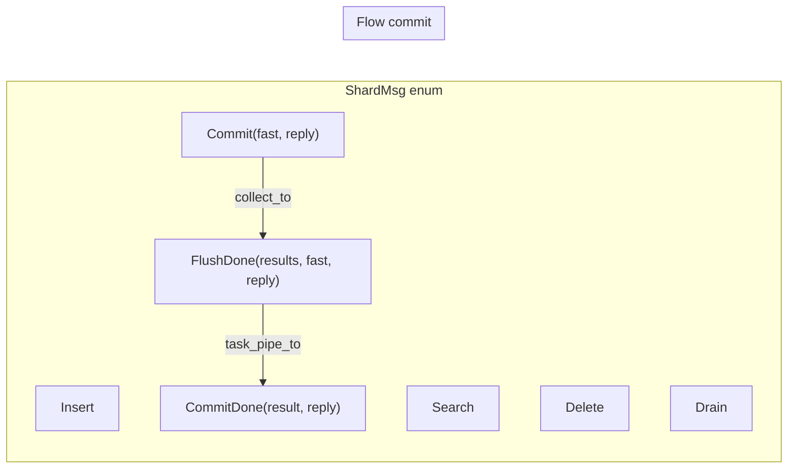
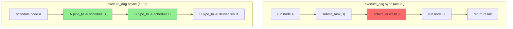

# Architecture : pipe_to — flow du commit sharde

## Aujourd'hui (Suspend + poll_idle)

Le ShardActor fait tout le cablage a la main, poll_idle finalise.
Le thread scheduler est capture pendant le commit DAG.

Probleme : `execute_dag` fait des cooperative waits sur un scheduler thread.
Si les 4 shards font ca en meme temps, starvation.

## Avec pipe_to + task_pipe_to (cible)

Aucun handler ne bloque. Le commit lourd tourne sur un thread task.
Les resultats reviennent comme des messages FIFO.

Chaque handler retourne Continue immediatement (vert).
Le travail lourd (execute_dag) tourne sur un thread task, pas sur un scheduler thread qui dispatche des acteurs.

## Messages du ShardActor

## Comparaison des patterns

```mermaid
graph TD
    subgraph "Pattern Suspend (ancien)"
        S1["handler"] --> S2["send + JoinResume"]
        S2 --> S3["return Suspend"]
        S3 --> S4["poll_idle"]
        S4 --> S5["collect results"]
        S5 --> S6["blocking work"]
        S6 --> S7["reply"]
        style S3 fill:#ff6b6b
        style S6 fill:#ff6b6b
    end

    subgraph "Pattern pipe_to (nouveau)"
        P1["handler"] --> P2["collect_to / pipe_to"]
        P2 --> P3["return Continue"]
        P3 --> P4["handler(ResultMsg)"]
        P4 --> P5["task_pipe_to si lourd"]
        P5 --> P6["return Continue"]
        P6 --> P7["handler(DoneMsg)"]
        P7 --> P8["reply"]
        style P3 fill:#90EE90
        style P6 fill:#90EE90
    end
```

## Vision future : execute_dag async

Aujourd'hui `execute_dag` est synchrone (bloque le thread appelant).
A terme, on pourrait le rendre pipe_to-based :

Chaque node completion declenche la suivante via pipe_to.
Aucun thread ne wait jamais. Mais c'est un refacto du runtime DAG
— pas necessaire maintenant car `task_pipe_to` suffit.
